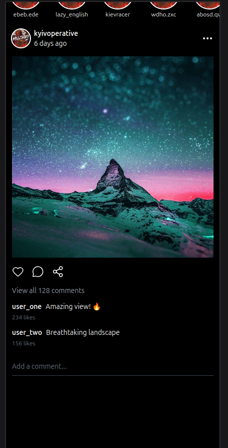

# Instagram Feed Learning

A modern, responsive Instagram feed clone built with React, Tailwind CSS, and Vite. This project demonstrates component-based architecture and modern web development practices.

## 🎯 Project Overview

This is a learning project that replicates Instagram's mobile feed interface. It features a modular component structure with post cards including header, body, actions, and comments sections.


## 🏗️ Architecture & Components

### Component Structure

The project follows a modular architecture with the following components:

```
FeedPost/
├── FeedPost.jsx           # Main post container
├── FeedPostHeader.jsx     # User info and timestamp
├── FeedPostBody.jsx       # Post image/content
├── FeedPostActions.jsx    # Like, comment, share buttons
└── FeedPostComments.jsx   # Comments section and input
```

### Features

- **FeedPost** - Main container component that orchestrates all sub-components
- **FeedPostHeader** - Displays user avatar, username, and timestamp
- **FeedPostBody** - Shows the post image/content
- **FeedPostActions** - Interactive buttons for like, comment, and share actions
- **FeedPostComments** - Displays comments with a reply input field
- **Header** - Navigation header with Instagram branding
- **StoryCarousel** - Carousel component for story elements
- **useScrollDirection Hook** - Custom hook for detecting scroll direction

## 🛠️ Tech Stack

- **React 19** - UI framework
- **Vite** - Build tool and dev server
- **Tailwind CSS 4** - Utility-first CSS framework
- **Lucide React** - Icon library
- **JavaScript (ES Modules)** - Module system

## 📋 Installation

1. Clone the repository:
```bash
git clone <repository-url>
cd instagram-feed-learning
```

2. Install dependencies:
```bash
npm install
```

## 🚀 Getting Started

### Development Server

Start the development server with hot module replacement:

```bash
npm run dev
```

The app will be available at `http://localhost:5173`

### Production Build

Create an optimized production build:

```bash
npm run build
```

### Preview Production Build

Preview the production build locally:

```bash
npm run preview
```

## 📝 Usage

The main entry point is `src/main.jsx`. The app renders the `App` component which includes the Header, StoryCarousel, and FeedPost components.

```jsx
import App from './App.jsx'
import './index.css'
import React from 'react'
import ReactDOM from 'react-dom/client'

ReactDOM.createRoot(document.getElementById('root')).render(
  <React.StrictMode>
    <App />
  </React.StrictMode>,
)
```

## 🎨 Styling

The project uses Tailwind CSS for styling with a dark Instagram-inspired theme. Custom styles are defined in:

- `src/index.css` - Global styles
- `src/App.css` - App-specific styles

### Color Scheme

- **Background** - Dark backgrounds matching Instagram's dark mode
- **Text** - White text for contrast
- **Accents** - Red/pink for interactive elements (likes, etc.)

## 🔧 Available Scripts

| Script | Description |
|--------|-------------|
| `npm run dev` | Start development server |
| `npm run build` | Build for production |
| `npm run preview` | Preview production build |
| `npm run lint` | Run ESLint to check code quality |

## 📱 Mobile Responsive

The application is built with a mobile-first approach and is fully responsive across all device sizes.

## 📚 Project Structure

```
instagram-feed-learning/
├── src/
│   ├── assets/              # Images and static assets
│   ├── features/            # Feature components
│   │   ├── FeedPost/       # Post-related components
│   │   ├── header/         # Header component
│   │   └── StoryCarousel/  # Story carousel component
│   ├── hooks/              # Custom React hooks
│   ├── App.jsx             # Main app component
│   ├── main.jsx            # React entry point
│   ├── App.css             # App styles
│   └── index.css           # Global styles
├── public/                 # Static files
├── img/                    # Project screenshots
├── index.html              # HTML entry point
├── package.json            # Dependencies and scripts
├── vite.config.js          # Vite configuration
└── eslint.config.js        # ESLint configuration
```

## 🎓 Learning Outcomes

This project demonstrates:

- Component composition and modularity
- React hooks usage
- Tailwind CSS utility-first styling
- Responsive design principles
- Modern JavaScript (ES6+)
- Vite as a modern build tool
- ESLint for code quality



## 🤝 Contributing

Feel free to fork this repository and submit pull requests for any improvements.

## 📄 License

This project is open source and available under the MIT License.

## 👨‍💻 Author

Created as a learning project for mastering React and modern web development.

---

**Happy Coding!** 🚀
